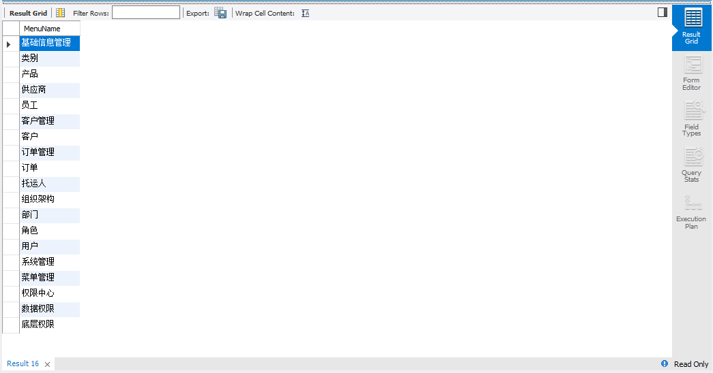

###RBAC权限管理
#####sql语句及结果截图
1、查询用户test1可以查看的页面（Sys_menu）  

    (select MenuName from sys_menu  
              where MenuID=(select PrivilegeAccessKey from cf_privilege  
                         where PrivilegeMaster="CF_User"              
                         and PrivilegeMasterKey=(select UserID from cf_user where LoginName="test1")  
                         and PrivilegeAccess="Sys_Menu"))  
              UNION            
    (select MenuName from sys_menu  
           where MenuID=any( select PrivilegeAccessKey from cf_privilege  
                          where PrivilegeMaster="CF_Role"  
                         and PrivilegeAccess="Sys_Menu"  
                         and PrivilegeMasterKey=(select RoleID from cf_userrole  
                                                  where UserId=(select UserID from cf_user where LoginName="test1"))  
                                                  and PrivilegeOperation="Permit"));  
                                              
  
2、test1对订单(order)页面中的操作权限(sys_button)  

    select BtnName from sys_button  
          where MenuNo=any(select MenuNo from  
                          (select * from cf_privilege  
                              where PrivilegeMasterKey=(select RoleID from cf_userrole  
                                                        where UserId=(select UserID from cf_user where LoginName="test1"))  
                              and PrivilegeMaster="CF_Role"  
                              and PrivilegeAccess="Sys_Menu"  
                              and PrivilegeOperation="Permit") as S1,sys_menu  
                           where sys_menu.MenuID=S1.PrivilegeAccessKey  
                           and MenuName="订单");  
                  
  
#####伪代码  
1.查询用户test1可以查看的页面（Sys_menu）  

    分两部分查询  
    （1）在privilege表中对user表查询，看test1用户是否具有特殊权限。  
       在user表中先根据test1查询userid，  
       在privilege表中查询出PrivilegeAccessKey   
       While 表为user，权限类别为menu，PrivilegeMasterKey为userid，权限为permit          
       在menu表中查询出页面名称  
       While menuid 为PrivilegeAccessKey      
    （2）在privilege表中对role表进行查询。  
       在user表中先根据test1查询userid，    
       在userrole表中根据userid查询roleid  
       在privilege表中查询出PrivilegeAccessKey  
       While 表为role，权限类别为menu，PrivilegeMasterKey为roleid，权限为permit        
       在menu表中查询出页面名称  
       While menuid 为any PrivilegeAccessKey       
    最后把这两个结果union一下。  
    
2.对订单(order)页面中的操作权限(sys_button)  

       在privilege表中对role表进行查询。  
       在user表中先根据test1查询userid，   
       在userrole表中根据userid查询roleid  
       在privilege表中查询*  
       While表为role，权限类别为menu，PrivilegeMasterKey为roleid，权限为permit  
       把查询结果作为表S1  
       对表S1和menu做连接查询  
       While menu表的id=S1的PrivilegeAccessKey，menuname=订单    
       从上述结果中查询出所有的menuno  
       在button表中查询操作名称  
       While menuno为上述结果中的any menuno  
              
